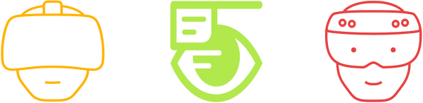
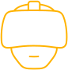
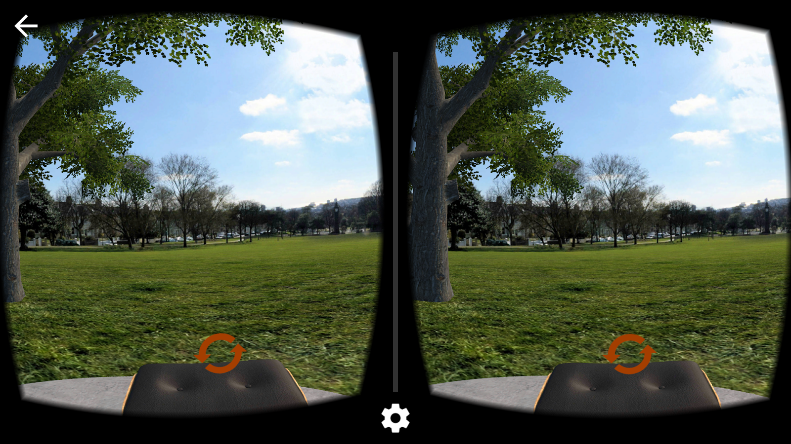
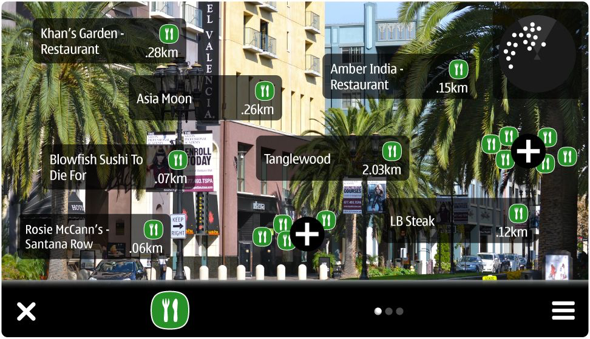
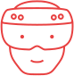
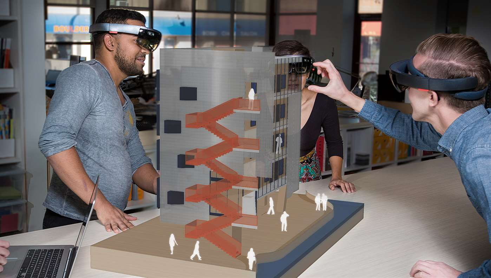
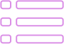
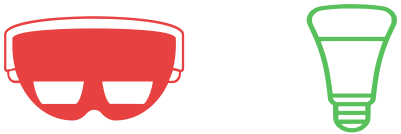
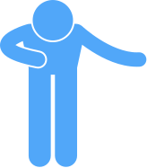

### Virtual / Augmented / Mixed
### Reality Tour
 

---

## Who am I?
 

----

**Name**: Zak Grant
 
 

**Role**: Solutions Architect in Emerging Technologies
 
 

**Specialism**: All things web

---

## Agenda

 

----

### Discovery
###### (20 mins)
 
> **I** will introduce each reality

----

### Interaction
###### (40 mins)
 
> **You** will interact with each reality

----

### Application
###### (30 mins)
 
> **You** will consider a reality into your IOT concept

----

### Share
###### (20 mins)
 
> **You** will present your IOT concepts usage of a reality

----

### Wind Up
###### (10 mins)

 

---

## Virtual Reality
 

----

### What is it?

> an artificial environment that is created with software and presented to the user in such a way that the user suspends belief and accepts it as a real environment

----

### Hardware

 

----

### What you see

----

### In the wild...

| | |
| :-------- | :---------------- |
| **Education** | Training Crane & Digger operators  Planet Earth II 360 |
| **Entertainment** | Gaming  Festival live streaming |
| **Health** | Practicing procedures on virtual patients  Psychiatric therapy coaching children with autism  and other mental health conditions |

---

## Augmented Reality

 

----

### What is it?

> the integration of digital information with the user's environment in real time

----

### Hardware

 

----

### What you see

 

----

### In the wild...

| | |
| :-------- | :---------------- |
| **Retail** | Lego Store Product Explorer  Clothes Shopping |
| **Entertainment** | Pokemon Go  Snapchat Lenses|
| **Data & Analytics** |  Patients stats in surgery  TODO|

---

## Mixed Reality

 

----

### What is it?

> is the merging of real and virtual worlds to produce new environments and visualizations where physical and digital objects co-exist and interact in real time.

----

### Hardware

 

----

### What you see
 

----

### In the wild...

| | |
| :-------- | :---------------- |
| **Engineering** | Measuring buildings for surveys   Advanced machinery repair |
| **Education** | Museum Interaction  Online tutoring & mentoring |
| **Health** | Patients stats in surgery  Remote / Shadowed surgery |

---

## Summarise Realities

 

----

| **Type** | **What is it?** | **Hardware** | **In the Wild** |
| :-------------: | :-------------: | :-------------: | :-------------: |
|  | Artificial environment |  | Education, Entertainment, Health |
|  | Real + Digital Layer |  | Retail Entertainment Data & Analytics |
|  | Virtual & Real object interaction |  | Engineering, Education, Health |

---

## Interaction time

 

----

### VR
###### (At your table...)

 

----

### AR
###### (At your table...)

 

----

### MR
###### (At the Hololens station...)

 

---

## Application to IOT

 

----

### Example

 

----

### Introduce a reality to **your** IOT concept

 

----

### Present how **you** have used a reality in your IOT concept

 

---

## Swag

 

----

> Google Cardboards are for you to keep :-)

---

## Feedback

 

----

> The good, the bad, and the ugly

---

## Quick Thank You...
 

----

> to my colleagues for helping out today

----

> to your school for hosting this activity

----

> to you for listening and participating

---

## Bio
 

----

 

https://twitter.com/zakgrant

----

 

https://github.com/zakgrant/

----

 

https://www.linkedin.com/in/zakgrant/

----

 

https://zakgrant.com

---

## The end.

 

----

## Credits

 

----

#### Icons

* Virtual Reality Goggles by Felisberto Piazza from the Noun Project
* Augmented Reality by Evangeline La from the Noun Project
* Augmented Reality Goggles by Felisberto Piazza from the Noun Project
* PC by Pravin Unagar from the Noun Project
* Pc tower by ProSymbols from the Noun Project

----

##### Icons contd...

* Plus by Zaff Studio from the Noun Project
* virtual reality headset by NOPIXEL from the Noun Project
* eye device by David Carrero from the Noun Project
* HoloLens by Laura Hernández from the Noun Project
* Smartphone by Royyan Wijaya from the Noun Project

----

##### Icons contd...

* bullet list by Designify.me from the Noun Project
* profile by mikicon from the Noun Project
* thank you by Gan Khoon Lay from the Noun Project
* like by ✦ Shmidt Sergey ✦ from the Noun Project
* Medal by logan from the Noun Project

----

##### Icons contd...

* Resume by Nathan Gathright from the Noun Project
* internet of things by Peter Borges from the Noun Project
* Megaphone by unlimicon from the Noun Project
* Money Bag by Loudoun Design Co. from the Noun Project
* Globe by iconoci from the Noun Project

----

##### Icons contd...

* interactive screen by Aneeque Ahmed from the Noun Project
* agenda by Aneeque Ahmed from the Noun Project
* Handshake by romzicon from the Noun Project
* Presenter by Oksana Latysheva from the Noun Project
* Philips Hue Bloom by Richard Slater from the Noun Project

----

##### Icons contd...

* Philips Hue Hub V2 by Richard Slater from the Noun Project
* HoloLens by Laura Hernández from the Noun Project
* cardboard vr by Jaya Kiran Reddy from the Noun Project
* Shark Face by Iconic from the Noun Project
* application by Nancy  from the Noun Project

----

##### Icons contd...

* Wind Up Key by Nina Geometrieva from the Noun Project
